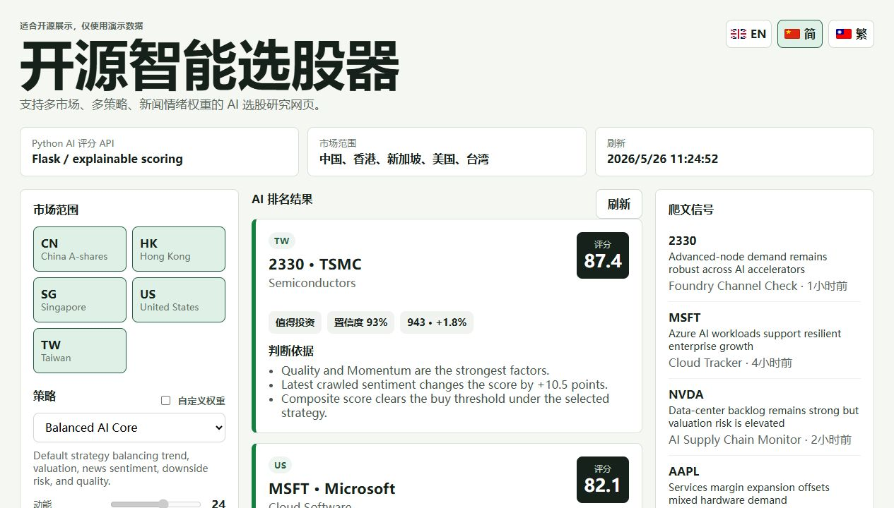

<p align="right">
  <a href="./README.md"> English</a> |
  <a href="./README.zh-TW.md"> 繁體中文</a> |
  <a href="./README.nan-TW.md"> 臺語</a> |
  <a href="./README.zh-CN.md"> 简体中文</a>
</p>

# Open Stock Picker

[](https://github.com/tamyu321-source/stock-picker/actions/workflows/ci.yml)
[](https://github.com/tamyu321-source/stock-picker/actions/workflows/deploy.yml)
[](./LICENSE)

Open Stock Picker 是一套用 AI 幫咱做股票研究的 Web App。主要流程是免寫程式的市場掃描：揀市場佮策略了後，予 Python 後端即時揣股票、評分、照分數排序，幫咱整理較有品質、適合投資研究的候選股。範圍包含中國 A 股、香港、日本、韓國、新加坡、美國佮臺灣。

這个 app 是照實際研究流程設計，毋是靜態作品集展示。它袂執行交易，嘛袂保存券商帳號抑是憑證。

**線頂預覽：** [tamyu321-source.github.io/stock-picker](https://tamyu321-source.github.io/stock-picker/)

GitHub Pages 版是靜態示範模式，用範例資料。若欲用即時行情、RSS/新聞爬取佮串流掃描，請佇本機啟動 Flask 後端。



## 臺語版用字

這份 README 用臺灣閩南語常見漢字佮白話語氣，技術名詞保留英文或通用寫法，予內容較好讀。若遇著無好寫的語氣，才用注音符號；這版先以漢字為主，避免變做整段注音。

## 為啥物值得用

- 毋免先輸入股票代號，就會使直接掃市場。
- 後端猶咧分析的時陣，前端會逐步顯示已經產生的候選股。
- 同一批評分結果會使看個股，也會使看板塊分析。
- 會使佇本機保存最近掃描，閣匯出 Markdown 抑是 JSON 研究筆記。
- 100 分制評分會拆做動能、估值、新聞氣口、風險佮品質。
- UI 支援英文、簡體中文、繁體中文、臺語、日文佮韓文。
- 若已經有指定標的，也會使用股票代號抑是公司名縮小掃描範圍。

## 功能

- Vue 3 + Vite Web 介面，會保存設定，嘛支援響應式研究工作區。
- Python Flask 後端，連接即時資料來源、RSS/新聞爬取佮會使解釋的評分模型。
- 自動探索市場股票池，毋是靠寫死的股票清單。
- 串流 NDJSON API，掃描較久嘛會逐步顯示結果。
- 本機保存掃描紀錄，嘛支援 Markdown 佮 JSON 匯出，方便後續研究。
- 透過 Yahoo Finance chart endpoints 取得價格歷史；若有安裝 `yfinance`，嘛會使選擇使用。
- 透過 Google News、Eastmoney fallback 佮在地來源篩選做市場別新聞爬取。
- 內建平衡型、成長型佮防守價值型投資策略。
- 家己調策略滑桿，會使調整動能、估值、新聞氣口、風險佮品質權重。
- 產生買入、觀察、退出風險判斷，閣附決策理由、來源連結、做法佮風控提醒。

## 市場範圍

| 市場 | 代號例 | 探索方式 |
| --- | --- | --- |
| 美國 | `AAPL`, `MSFT`, `NVDA` | Yahoo Finance 篩選器佮新聞搜尋 |
| 中國 A 股 | `600519.SS`, `300750.SZ` | Eastmoney 市場清單、在地名佮備援 metadata |
| 香港 | `0700.HK`, `9988.HK` | Eastmoney 港股清單佮公司別名 |
| 日本 | `7203.T`, `6758.T` | 高流動性備援股票池佮 Yahoo 代號 |
| 韓國 | `005930.KS`, `000660.KS` | 高流動性備援股票池佮 Yahoo 代號 |
| 新加坡 | `D05.SI`, `C38U.SI` | SGX securities API，照成交量排序 |
| 臺灣 | `2330.TW`, `2317.TW` | TWSE 開放資料、在地公司名佮 Yahoo/TWSE fallback |

## 架構

```text
Vue 3 web app
  -> /api/config          strategy, market, and default ticker metadata
  -> /api/analyze         live data fetch, RSS crawl, scoring, verdicts, explanations
  -> /api/analyze/stream  incremental NDJSON scan events

Flask backend
  -> backend/universe.py   dynamic market-universe discovery
  -> backend/providers.py  market data providers and RSS/news crawlers
  -> backend/services.py   metric calculation, strategy selection, explainable scoring
  -> backend/app.py        REST API
```

## 本機開發

```powershell
npm install
python -m venv .venv
.\.venv\Scripts\Activate.ps1
pip install -r requirements.txt
python -m backend.app
```

佇第二个 terminal 啟動 frontend：

```powershell
npm run dev
```

開 `http://127.0.0.1:5173`。

## 靜態示範佮即時後端

- GitHub Pages 只服務 Vue 靜態檔，所以用內建範例資料，予訪客先看介面。
- 本機開發啟動 `python -m backend.app` 了後，才會使用即時 `/api/config`、`/api/analyze` 佮 `/api/analyze/stream`。
- App 頂懸會顯示資料模式，予使用者知影這馬是範例資料抑是即時後端結果。

## 免寫程式掃市場

主要使用方式是共選填股票欄位留空。後端會佇 request 的時陣揣候選股票，閣照分數排做投資研究想法。

空白掃描的探索順序：

1. 在地財經新聞來源。
2. Google News 市場搜尋。
3. Yahoo、Eastmoney、SGX、TWSE 等市場股票池 API。
4. 即時來源不可用的時，用高流動性備援清單。

API 回應有 `scan.source`、`scan.requested`、`scan.succeeded`、`scan.displayed`、`scan.failed` 佮 `scan.discoveryErrors`，予 UI 會使顯示掃描是來自即時探索、新聞帶路探索，抑是備援資料。

## 評分模型

- `momentum`：用歷史收盤價計算近期價格趨勢。
- `value`：用 trailing PE、forward PE、price-to-book 佮可用替代指標計算估值分數。
- `sentiment`：近期市場別新聞內容，照來源可信度、文章新鮮度、公司相關性、標題佮摘要加權。
- `risk`：beta、實現波動率佮嚴重價格走弱檢查。
- `quality`：若資料有，就用 ROE、利潤率、負債權益比、成長、規模佮流動性。

策略權重決定這寡指標按怎合做最後分數。結果是研究輔助，毋是財務建議。

## 測試

```powershell
python -m unittest discover backend/tests
npm run build
```

Pull request 愛通過 GitHub Actions 內底的後端測試佮前端 build。

## 部署筆記

Linux 例：

```bash
python -m venv .venv
source .venv/bin/activate
pip install -r requirements.txt
npm ci
npm run build
gunicorn 'backend.app:app' --bind 127.0.0.1:8000
```

Windows 例：

```powershell
python -m venv .venv
.\.venv\Scripts\Activate.ps1
pip install -r requirements.txt
npm install
npm run build
waitress-serve --listen=127.0.0.1:8000 backend.app:app
```

用 Nginx、IIS 抑是其他 reverse proxy 服務 `dist/`，閣共 `/api` 轉送去 Flask service。

## 參與貢獻佮安全

- [CONTRIBUTING.md](./CONTRIBUTING.md) 說明本機流程、驗證命令佮貢獻範圍。
- [SECURITY.md](./SECURITY.md) 說明回報方式佮目前安全模型。

## 免責聲明

這个 app 干焦提供投資研究流程輔助，毋是財務建議，嘛袂執行交易。
